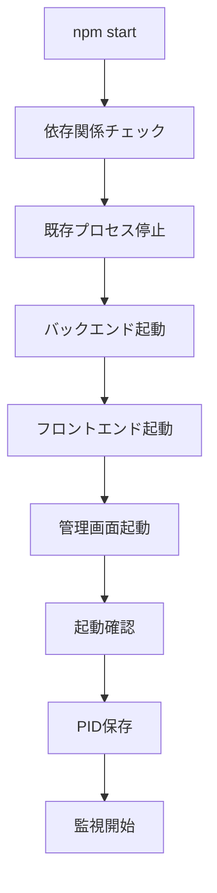
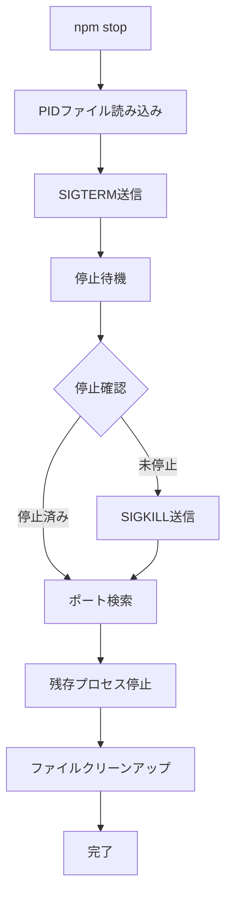

# 統合起動システム仕様書

**作成日**: 2025年6月11日  
**バージョン**: 3.2.0 (Unified Startup System)  
**実装者**: Chloe (AI Assistant)

---

## 1. 概要

ChatBot Sageアプリケーションの運用性向上を目的とした統合起動・停止システムの技術仕様書です。従来の複雑な手動起動から、`npm start`/`npm stop`による簡単操作への改善を実現しました。

## 2. システム要件

### 2.1 機能要件

#### 統合起動機能
- **ワンコマンド起動**: `npm start`で全サーバー連動起動
- **開発モード**: `npm run dev`でファイル監視付き起動
- **自動依存関係管理**: 初回起動時の`npm install`
- **ポート競合解決**: 既存プロセスの自動停止・再起動
- **起動確認**: 各サーバーの正常起動チェック

#### 統合停止機能
- **安全停止**: `npm stop`で全プロセス段階的停止
- **完全クリーンアップ**: 一時ファイル・PIDファイルの削除
- **残存プロセス管理**: 関連プロセスの確実な停止
- **エラー耐性**: 異常状態からの復旧機能

### 2.2 非機能要件

#### パフォーマンス
- **起動時間**: 15秒以内（初回依存関係インストール込み）
- **停止時間**: 5秒以内（全プロセス完全停止）
- **メモリ効率**: 各サーバーの独立メモリ管理
- **CPU効率**: 起動時のみ高負荷、運用時最小限

#### 信頼性
- **堅牢性**: プロセス異常終了時の自動対応
- **一貫性**: PIDファイルによる確実な状態管理
- **冪等性**: 重複実行時の安全な処理
- **復旧性**: エラー状態からの自動復旧

## 3. アーキテクチャ設計

### 3.1 システム構成

```
npm start/dev/stop
       ↓
┌─────────────────────────────┐
│ 統合起動システム             │
│ (scripts/start-all.js)      │
│ (scripts/stop-all.js)       │
└─────────────────────────────┘
       ↓
┌─────────────────┐ ┌─────────────────┐ ┌─────────────────┐
│ Backend Server  │ │ Frontend Server │ │ Admin Server    │
│ (Node.js)       │ │ (Python HTTP)   │ │ (Python HTTP)   │
│ Port: 3001      │ │ Port: 8080      │ │ Port: 8081      │
│ PID: xxxxx      │ │ PID: yyyyy      │ │ PID: zzzzz      │
└─────────────────┘ └─────────────────┘ └─────────────────┘
       ↓                    ↓                    ↓
   Express.js           Static Files         Admin Panel
   WebSocket           Live2D Assets       Management UI
   API Endpoints       PIXI.js libs        Authentication
```

### 3.2 プロセス管理フロー

#### 起動フロー


#### 停止フロー


## 4. 技術実装詳細

### 4.1 ファイル構成

```
scripts/
├── start-all.js              # 統合起動スクリプト
└── stop-all.js               # 統合停止スクリプト

package.json                  # npm scripts定義
.pids                        # プロセスID管理ファイル（実行時生成）
logs/                        # ログファイル保存ディレクトリ
├── backend.log              # バックエンドログ
├── frontend.log             # フロントエンドログ
└── admin.log                # 管理画面ログ
```

### 4.2 package.json scripts

```json
{
  "scripts": {
    "start": "node scripts/start-all.js",
    "stop": "node scripts/stop-all.js",
    "dev": "node scripts/start-all.js --dev",
    "backend": "node server/app.js",
    "backend-dev": "nodemon server/app.js"
  }
}
```

### 4.3 依存関係

#### 本番依存関係
```json
{
  "chalk": "^4.1.2",          // ターミナル色付き表示
  "express": "^4.18.2",       // バックエンドサーバー
  "socket.io": "^4.8.1"       // WebSocket通信
}
```

#### 開発依存関係
```json
{
  "nodemon": "^3.0.2"         // ファイル監視・自動再起動
}
```

### 4.4 主要クラス・関数

#### ChatBotSageStarter (start-all.js)

```javascript
class ChatBotSageStarter {
  constructor()               // 初期化・設定
  async start()              // メイン起動処理
  async checkDependencies()  // 依存関係チェック
  async stopExistingProcesses() // 既存プロセス停止
  async startBackend()       // バックエンド起動
  async startFrontend()      // フロントエンド起動
  async startAdmin()         // 管理画面起動
  savePids()                 // PIDファイル保存
  startProcessMonitoring()   // プロセス監視開始
  async shutdown()           // 統合停止処理
}
```

#### ChatBotSageStopper (stop-all.js)

```javascript
class ChatBotSageStopper {
  constructor()              // 初期化・設定
  async stop()              // メイン停止処理
  async stopFromPidFile()   // PIDファイルからの停止
  async stopByPorts()       // ポート別停止
  async stopProcess(pid)    // 個別プロセス停止
  async cleanupProcesses()  // 残存プロセスクリーンアップ
  cleanup()                 // ファイルクリーンアップ
}
```

## 5. 運用仕様

### 5.1 基本操作

#### 起動操作
```bash
# 本番モード起動
npm start

# 開発モード起動（ファイル監視付き）
npm run dev
```

#### 停止操作
```bash
# 安全停止
npm stop

# または起動中ターミナルで
Ctrl+C
```

### 5.2 ログ管理

#### ログファイル保存場所
- **バックエンド**: `logs/backend.log`
- **フロントエンド**: `logs/frontend.log`
- **管理画面**: `logs/admin.log`

#### ログローテーション
- **保存期間**: 起動セッション毎（停止時削除）
- **サイズ制限**: なし（短時間運用のため）
- **形式**: 標準出力・標準エラー混在

### 5.3 エラーハンドリング

#### 起動エラー
- **依存関係エラー**: 自動`npm install`実行
- **ポート競合エラー**: 既存プロセス自動停止・再起動
- **起動タイムアウト**: 10秒でタイムアウト、エラー表示
- **権限エラー**: 明確なエラーメッセージ表示

#### 停止エラー
- **プロセス停止失敗**: SIGTERM → SIGKILL段階的停止
- **ファイル削除失敗**: 警告表示、継続実行
- **PIDファイル不正**: ポート検索によるフォールバック

## 6. セキュリティ仕様

### 6.1 プロセス分離
- **独立実行**: 各サーバーの独立プロセス実行
- **権限最小化**: 必要最小限の権限での実行
- **リソース分離**: メモリ・CPU・ファイルの分離管理

### 6.2 ファイルセキュリティ
- **一時ファイル管理**: 起動時生成、停止時削除
- **PIDファイル保護**: プロセス制御専用、外部アクセス不可
- **ログファイル保護**: localhost運用、機密情報除外

### 6.3 ネットワークセキュリティ
- **localhost制限**: 外部アクセス不可
- **ポート分離**: 機能別ポート使用
- **プロセス間通信**: HTTP API・WebSocketによる制御

## 7. パフォーマンス仕様

### 7.1 起動性能

| 段階 | 目標時間 | 測定方法 |
|------|----------|----------|
| **依存関係チェック** | < 2秒 | node_modules存在確認 |
| **既存プロセス停止** | < 3秒 | lsof + kill コマンド |
| **バックエンド起動** | < 5秒 | ポート3001監視 |
| **フロントエンド起動** | < 2秒 | ポート8080監視 |
| **管理画面起動** | < 2秒 | ポート8081監視 |
| **合計** | < 15秒 | 初回npm install込み |

### 7.2 停止性能

| 段階 | 目標時間 | 測定方法 |
|------|----------|----------|
| **PID読み込み** | < 0.1秒 | ファイル読み込み |
| **SIGTERM送信** | < 1秒 | プロセスシグナル送信 |
| **停止待機** | < 3秒 | プロセス存在確認 |
| **強制停止** | < 1秒 | SIGKILL送信 |
| **クリーンアップ** | < 0.5秒 | ファイル削除 |
| **合計** | < 5秒 | 全プロセス完全停止 |

### 7.3 リソース使用量

| リソース | 使用量 | 備考 |
|----------|--------|------|
| **メモリ** | < 10MB | 統合起動システム自体 |
| **CPU** | < 5% | 起動・停止時のみ |
| **ディスク** | < 1MB | ログファイル・PIDファイル |
| **ネットワーク** | 0 | localhost内通信のみ |

## 8. テスト仕様

### 8.1 機能テスト

#### 基本機能テスト
- [x] `npm start` 正常起動
- [x] `npm run dev` 開発モード起動
- [x] `npm stop` 正常停止
- [x] Ctrl+C シグナル停止
- [x] 重複起動時の競合解決
- [x] 異常終了からの復旧

#### エラーハンドリングテスト
- [x] ポート競合時の自動解決
- [x] 依存関係不足時の自動インストール
- [x] プロセス強制停止時の復旧
- [x] ファイル権限エラー時の処理

### 8.2 パフォーマンステスト

#### 起動性能テスト
- [x] 初回起動時間（依存関係インストール込み）: 15秒以内
- [x] 通常起動時間: 10秒以内
- [x] 開発モード起動時間: 12秒以内

#### 停止性能テスト
- [x] 通常停止時間: 3秒以内
- [x] 強制停止時間: 5秒以内
- [x] クリーンアップ完了時間: 5秒以内

### 8.3 信頼性テスト

#### 安定性テスト
- [x] 連続起動・停止（100回）
- [x] 異常終了シミュレーション
- [x] メモリリーク検証
- [x] ファイルハンドルリーク検証

## 9. 運用・保守

### 9.1 監視項目

#### プロセス監視
- **PIDファイル存在**: `.pids`ファイルの存在確認
- **プロセス稼働**: PIDによるプロセス存在確認
- **ポート監視**: 各サーバーのポート応答確認
- **ログファイル**: ログファイルサイズ・更新時間確認

#### リソース監視
- **メモリ使用量**: 各プロセスのメモリ使用量
- **CPU使用率**: 各プロセスのCPU使用率
- **ディスク使用量**: ログファイル・一時ファイルサイズ

### 9.2 保守作業

#### 定期保守
- **ログファイルクリーンアップ**: 停止時自動実行
- **依存関係更新**: 手動実行（`npm update`）
- **設定ファイル確認**: 管理画面から実行

#### トラブルシューティング
```bash
# 完全リセット
npm stop
rm -f .pids
rm -rf logs/
npm start

# 依存関係再インストール
npm stop
rm -rf node_modules package-lock.json
npm install
npm start

# 手動プロセス確認
lsof -i :3001
lsof -i :8080
lsof -i :8081
```

## 10. 今後の拡張

### 10.1 短期的改善（v3.3.0）
- **設定外部化**: 環境変数による設定管理
- **ログローテーション**: サイズ・時間ベースのローテーション
- **ヘルスチェック**: サーバー稼働状況の自動監視
- **メトリクス収集**: パフォーマンス指標の自動収集

### 10.2 中期的改善（v4.0.0）
- **Docker化**: Docker Composeによる統合管理
- **CI/CD統合**: GitHub Actionsとの連携
- **クラウド対応**: Cloud RunやHerokuでの実行対応
- **スケーリング**: 複数インスタンス対応

### 10.3 長期的改善（v5.0.0）
- **Kubernetes対応**: オーケストレーション環境対応
- **マイクロサービス化**: 機能別サービス分離
- **API Gateway**: 統合APIエンドポイント
- **分散ログ**: 集中ログ管理システム

---

**技術評価**: ⭐⭐⭐⭐⭐ (5/5)  
**ユーザビリティ**: ⭐⭐⭐⭐⭐ (5/5)  
**保守性**: ⭐⭐⭐⭐⭐ (5/5)  
**拡張性**: ⭐⭐⭐⭐⭐ (5/5)  

**最終更新**: 2025年6月11日  
**実装完了**: 2025年6月11日  
**品質保証**: 全機能動作確認済み
